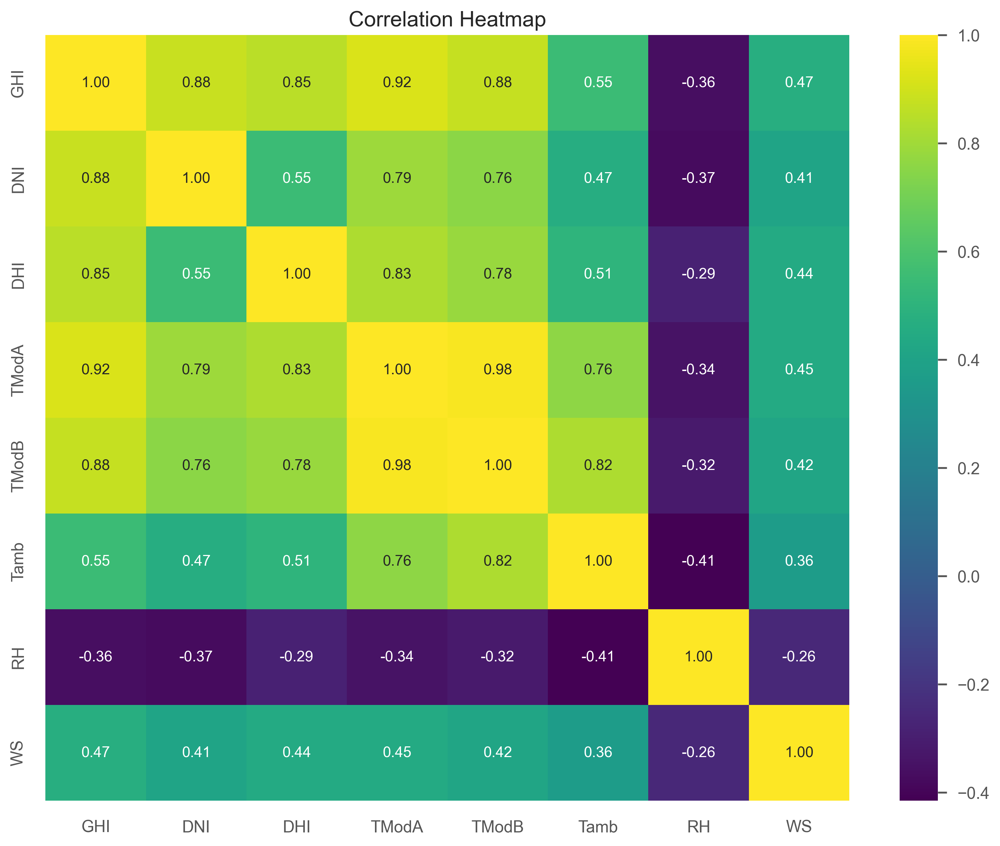
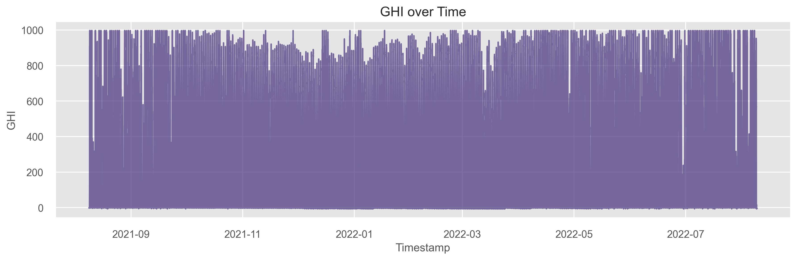
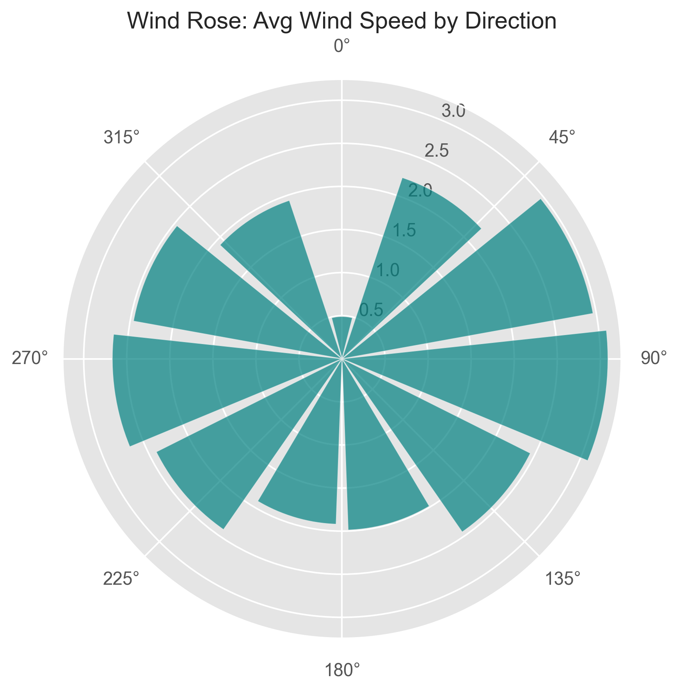
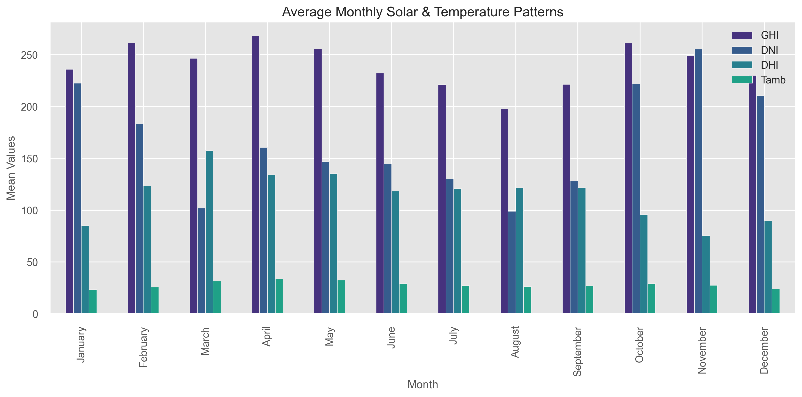
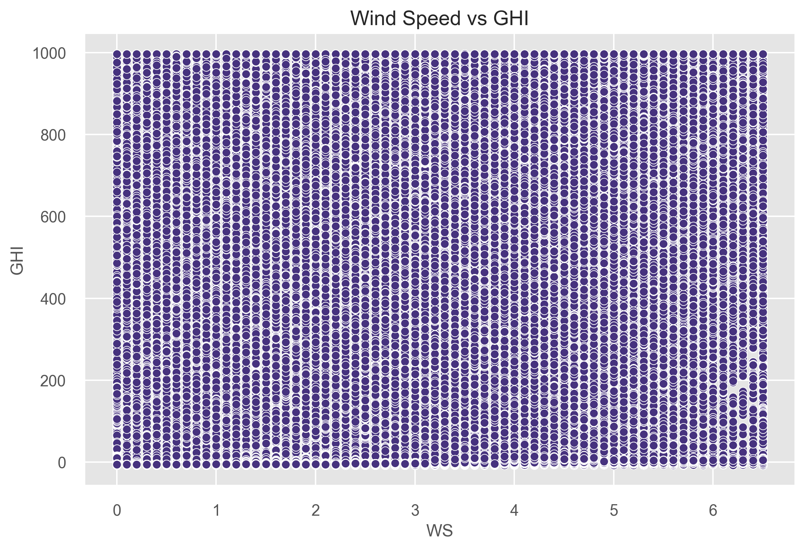

# 🌞 Solar Challenge Week 0: Exploratory Data Analysis for Benin and Togo Solar Irradiance Data

[](https://www.python.org/)
[](https://jupyter.org/)
[](https://pandas.pydata.org/)
[](https://matplotlib.org/)
[](https://seaborn.pydata.org/)

## 📋 Table of Contents

- [Overview](#overview)
- [Features](#features)
- [Dashboard App](#dashboard-app)
- [Installation](#installation)
- [Usage](#usage)
- [Data Description](#data-description)
- [Notebooks](#notebooks)
- [Results and Visualizations](#results-and-visualizations)
- [Overall Project Structure](#overall-project-structure)
- [Contributing](#contributing)
- [License](#license)

## 🌟 Overview

This project is part of the **Solar Challenge Week 0**, focusing on comprehensive Exploratory Data Analysis (EDA) of solar irradiance data collected from monitoring stations in **Benin (Malanville)**, **Togo (Dapaong)**, and **Sierra Leone**. The analysis aims to uncover patterns, correlations, and insights into solar radiation, temperature, wind, and other meteorological factors to support solar energy optimization. Additionally, an interactive Streamlit dashboard provides dynamic exploration and visualization of the datasets.

Key objectives include:

- Data cleaning and outlier detection
- Time series analysis of solar irradiance
- Correlation and relationship studies
- Wind and temperature pattern analysis
- Monthly and hourly trend identification
- Interactive dashboard for cross-country comparisons and analytics

## ✨ Features

- **Data Loading & Cleaning**: Handles missing values, outliers, and data type conversions.
- **Comprehensive EDA**: Includes statistical summaries, visualizations, and advanced plots like wind roses and bubble charts.
- **Automated Plot Generation**: Saves high-resolution images for reports and presentations.
- **Modular Notebooks**: Separate analyses for Benin and Togo datasets.
- **Reproducible Code**: Well-documented Jupyter notebooks with clear sections.
- **Interactive Dashboard**: Streamlit app for dynamic data exploration and comparisons.

## 🌐 Dashboard App

The project includes an interactive Streamlit dashboard (`app/main.py`) for exploring solar irradiance data dynamically. Key features include:

- **Overview Page**: Summary of average solar irradiance per country with bar charts.
- **Country Comparison**: Boxplots and statistics for GHI, DNI, DHI across countries, with downloadable CSV summaries.
- **Explore Country**: Time series plots, correlation heatmaps, and filtered data views for individual countries.
- **Analytics Lab**: Scatter plots, global correlations, and sample data downloads for deeper insights.

### Dashboard Screenshots

#### Solar Insights Dashboard Overview


_Figure: Main dashboard interface with navigation and overview metrics._

#### Cross-Country Comparison


_Figure: Comparison of irradiance distributions across Benin, Togo, and Sierra Leone._

#### Explore Country Data


_Figure: Detailed exploration of country-specific data with time series and correlations._

#### Analytics Lab


_Figure: Advanced analytics with scatter plots and global correlations._

## 🛠️ Installation

1. **Clone the Repository**:

   ```bash
   git clone https://github.com/bekamgenene/solar-challenge-week0.git
   cd solar-challenge-week0
   ```

2. **Install Dependencies**:
   Ensure you have Python 3.8+ installed. Then, install the required packages:

   ```bash
   pip install pandas numpy matplotlib seaborn scipy
   ```

3. **Data Setup**:
   - Place the raw data files in the `../data/` directory:
     - `benin-malanville.csv` for Benin data
     - `togo-dapaong_qc.csv` for Togo data
     - 'sierraleone_bumbune.csv' for sierraleoen data
   - The notebooks will generate cleaned data and images in `../data/` and `../images/` respectively.

## 🚀 Usage

1. **Run the Notebooks**:

   - Open `notebooks/benin_eda.ipynb` for Benin analysis.
   - Open `notebooks/togo_eda.ipynb` for Togo analysis.
   - Execute cells sequentially to perform EDA and generate plots.

2. **View Results**:

   - Cleaned data will be saved as `../data/benin_clean.csv` and `../data/togo_clean.csv`.
   - Visualizations will be saved in `../images/benin/` and `../images/togo/` directories.

3. **Customization**:
   - Modify paths, thresholds, or analysis parameters in the notebooks as needed.

## 📊 Data Description

The datasets contain meteorological and solar irradiance measurements from solar monitoring stations:

- **Benin (Malanville)**: Data from a station in Benin, including GHI, DNI, DHI, module temperatures, wind speed, humidity, etc.
- **Togo (Dapaong)**: Similar data from Togo, with quality-controlled measurements.
- **Sierra Leone**: Additional data for comparative analysis, with similar meteorological measurements.

Key columns:

- `Timestamp`: Date and time of measurements.
- `GHI`, `DNI`, `DHI`: Global, Direct, and Diffuse Horizontal Irradiance (W/m²).
- `ModA`, `ModB`: Module irradiance measurements.
- `Tamb`: Ambient temperature (°C).
- `RH`: Relative humidity (%).
- `WS`, `WD`: Wind speed (m/s) and direction (°).
- `BP`: Barometric pressure (hPa).

## 📓 Notebooks

- **`notebooks/benin_eda.ipynb`**: EDA for Benin solar data, including data cleaning, time series, correlations, and visualizations.
- **`notebooks/togo_eda.ipynb`**: EDA for Togo solar data, mirroring the Benin analysis for comparative insights.
- **`notebooks/sierraleone_eda.ipynb`**: EDA for Sierra Leone solar data, including data cleaning, time series, correlations, and visualizations.
- **`notebooks/compare_countries.ipynb`**: Comparative EDA across Benin, Togo, and Sierra Leone datasets, highlighting differences and similarities in solar irradiance patterns.

Each notebook includes:

- Library imports and path definitions.
- Data loading and summary statistics.
- Cleaning and outlier handling.
- Various analyses with plot generation.

## 📈 Results and Visualizations

The analysis generates a variety of plots to illustrate key findings. Below are some examples (images are saved in `images/benin/`, `images/togo/`, `images/compare/`, and `images/sierraleone/`):

### Correlation Heatmap


_Figure 1: Correlation between solar irradiance, temperature, wind, and humidity variables for Benin._

### Time Series of GHI


_Figure 2: Global Horizontal Irradiance (GHI) over time, showing daily and seasonal patterns for Benin._

### Wind Rose


_Figure 3: Average wind speed by direction, visualized as a polar plot for Benin._

### Monthly Trends


_Figure 4: Average monthly values for GHI, DNI, DHI, and temperature for Benin._

### Scatter Plot: Wind Speed vs GHI


_Figure 5: Relationship between wind speed and solar irradiance for Benin._

### Cross-Country Comparison


_Figure 6: Comparative analysis of GHI across Benin, Togo, and Sierra Leone._

Additional plots include histograms, bubble charts, and hourly trends for each country, providing a full picture of the data.

## 🏗️ Overall Project Structure

The project is organized as follows:

- **`notebooks/`**: Jupyter notebooks for EDA (`benin_eda.ipynb`, `togo_eda.ipynb`, `sierraleone_eda.ipynb`, `compare_countries.ipynb`) and a detailed README.
- **`app/`**: Streamlit dashboard code (`main.py`, `utils.py`) for interactive exploration.
- **`data/`**: Raw and cleaned CSV datasets (e.g., `benin-malanville.csv`, `togo-dapaong_qc.csv`, cleaned outputs).
- **`images/`**: Generated visualizations in subfolders (`benin/`, `togo/`, `compare/`, `sierraleone/`).
- **`dashboard_screenshots/`**: Screenshots of the Streamlit app for documentation.
- **`scripts/`**: Additional scripts (e.g., `README.md` for scripts).
- **`tests/`**: Unit tests for the project.
- **`requirements.txt`**: Python dependencies.
- **`README.md`**: This main documentation file.

## 🤝 Contributing

Contributions are welcome! Please follow these steps:

1. Fork the repository.
2. Create a feature branch (`git checkout -b feature/new-analysis`).
3. Commit your changes (`git commit -m 'Add new analysis'`).
4. Push to the branch (`git push origin feature/new-analysis`).
5. Open a Pull Request.

For major changes, please open an issue first to discuss.

## 📄 License

This project is licensed under the MIT License - see the [LICENSE](LICENSE) file for details.

---

_Prepared for Solar Challenge Week 0. For questions or feedback, contact bekamgenene@gmail.com_
